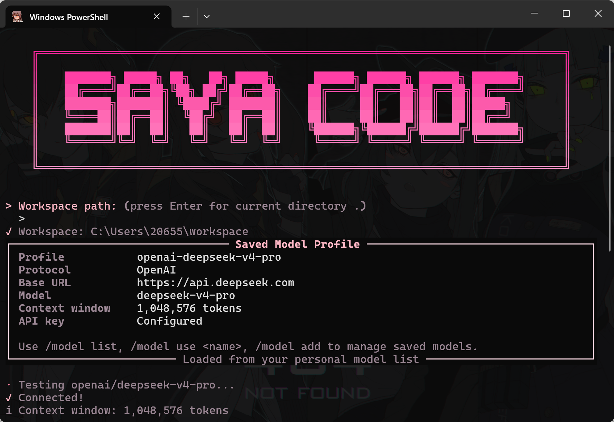

<p align="center">
  
</p>

<p align="center">
  <a href="https://pypi.org/project/sayacode/"></a>
  <a href="https://github.com/saya-ch/sayacode/actions"></a>
  
  <a href="LICENSE"></a>
</p>

<p align="center">
  <b>运行在终端里的 AI 编程 Agent。</b>
  <br>
  读项目、改代码、跑命令、管 Git、接 MCP，并把权限、审计、记忆和人格风格都收进一个 CLI 工作流。
</p>

---

## 目录

- [SAYACODE 是什么](#sayacode-是什么)
- [核心特性](#核心特性)
- [快速开始](#快速开始)
- [模型配置](#模型配置)
- [常用命令](#常用命令)
- [工作模式](#工作模式)
- [内置工具](#内置工具)
- [安全与权限](#安全与权限)
- [MCP、Hook 与项目记忆](#mcphook-与项目记忆)
- [自定义 Slash 命令](#自定义-slash-命令)
- [本地状态文件](#本地状态文件)
- [开发](#开发)
- [项目结构](#项目结构)
- [License](#license)

## SAYACODE 是什么

SAYACODE 是一个面向真实代码仓库工作的终端 AI 编程助手，基于 LangChain / LangGraph 生态构建。它不是只会回答问题的聊天壳，而是一个带运行时上下文、工具注册、权限策略、Hook 事件、MCP 扩展、会话持久化和项目记忆的 CLI Agent。

你可以把它放在任意项目目录里，然后让它：

- 梳理仓库结构、入口、依赖和测试布局。
- 读取、搜索、编辑、批量修改文件。
- 执行非交互式 Shell 命令并保存超长输出。
- 查看 Git diff、暂存、提交、拉取、推送。
- 维护多会话、多模型配置和持久项目记忆。
- 接入 Claude Code 风格的 `.mcp.json` 与 `.claude/commands/*.md`。

SAYACODE 默认假设你是在本机可信项目里工作，因此能力边界偏向“能干活”。同时，它也提供权限策略、危险操作拦截、敏感文件保护、审计日志和只读模式，避免高权限 Agent 变成不可追踪的黑箱。

## 核心特性

| 能力          | 说明                                                                                                            |
| ------------- | --------------------------------------------------------------------------------------------------------------- |
| 多模型运行时  | 支持 OpenAI-compatible、Anthropic-compatible、Gemini-compatible 与 Ollama 协议配置。                            |
| 32 个内置工具 | 文件、Shell、Git、Web 搜索、项目分析、符号索引、诊断、安全检查、ToolSearch 等统一注册。                         |
| 3 种工作模式  | `build` 可实现和修改；`plan` 只读规划；`review` 只读审查。                                                |
| 9 种人格风格  | 标准、简洁、傲娇、元气、雌小鬼、姐姐、偶像、猫娘、无口，可用 `/style` 切换。                                  |
| 会话与上下文  | 工作区级会话索引、历史恢复、上下文窗口检测、分层压缩（预防性/标准/紧急）和会话归档。                            |
| 自动错误恢复  | API 限流/超时自动重试（指数退避），输出超长自动续接，上下文溢出触发紧急压缩。                                   |
| 并发工具执行  | 只读工具（搜索/读取/分析）并行执行，变更工具顺序执行；Shell/Git 失败触发同级中止。                              |
| 项目记忆      | 自动加载 `SAYACODE.md` / `CLAUDE.md` 和用户级 `~/.sayacode/memory.md`。                                   |
| MCP 扩展      | 读取项目 `.mcp.json`，显式 trust 后加载外部 MCP 工具。                                                        |
| Hook 事件     | 支持 `SessionStart`、`UserPromptSubmit`、`PreToolUse`、`PostToolUse`、`ToolFailure`、`SessionEnd`。 |
| 权限与审计    | 三层权限策略 + 按来源分层规则（用户/项目/会话）+ 连续拒绝自动回退询问模式。工具调用写入审计日志。               |
| 多 Agent 协作 | `/team` 命令启动子 Agent，文件系统邮箱通信，支持并行处理。                                                    |
| 双语 CLI      | `--lang zh/en/auto` 与 `/lang` 支持中英文界面切换。                                                         |

<p align="center">
  
</p>

## 快速开始

### 环境要求

- Python `>= 3.11`
- 推荐使用支持 UTF-8 的终端
- 如使用本地模型，先启动 Ollama 服务

### 安装

```bash
pip install sayacode
```

Conda 用户：

```bash
conda create -n sayacode python=3.13 -y
conda activate sayacode
pip install sayacode
```

从源码安装：

```bash
git clone https://github.com/saya-ch/sayacode.git
cd sayacode
pip install .
```

开发模式安装：

```bash
git clone https://github.com/saya-ch/sayacode.git
cd sayacode
pip install -e ".[dev]"
```

### 启动

```bash
sayacode
```

指定工作区：

```bash
sayacode --workspace ./my-project
```

常见启动参数：

```bash
sayacode --model-type ollama --model-name qwen3.5:9b
sayacode --model-type openai --model-name gpt-4 --context-window 128000
sayacode --model-type gemini --model-name gemini-2.5-flash
sayacode --style concise --mode review
sayacode --doctor
```

首次启动时，SAYACODE 会引导你选择模型协议、Base URL、API Key、模型名和上下文窗口。配置会保存在本机 `~/.sayacode/`，不会写进项目仓库。

<p align="center">
  
</p>

## 模型配置

SAYACODE 的模型配置由 `APIConfigManager` 管理，支持保存多个 profile 并自动恢复当前 profile。下表中的 `model-type` 是兼容接口/协议适配器，而不是对单一厂商的硬绑定；只要服务端提供相应兼容接口，就可以通过 `--base-url` 接入。

| 兼容接口 / 协议                      | 默认 Base URL                                        | 默认模型                     | 默认环境变量          |
| ------------------------------------ | ---------------------------------------------------- | ---------------------------- | --------------------- |
| `openai` / OpenAI-compatible       | `https://api.openai.com/v1`                        | `gpt-4`                    | `OPENAI_API_KEY`    |
| `anthropic` / Anthropic-compatible | `https://api.anthropic.com/v1`                     | `claude-sonnet-4-20250514` | `ANTHROPIC_API_KEY` |
| `gemini` / Gemini-compatible       | `https://generativelanguage.googleapis.com/v1beta` | `gemini-2.5-flash`         | `GEMINI_API_KEY`    |
| `ollama` / Ollama API              | `http://localhost:11434`                           | `qwen3.5:9b`               | 不需要                |

你可以通过环境变量提供密钥：

```bash
export OPENAI_API_KEY="..."
export ANTHROPIC_API_KEY="..."
export GEMINI_API_KEY="..."
```

Windows PowerShell：

```powershell
$env:OPENAI_API_KEY="..."
```

本地或自托管的兼容接口可以通过 `--base-url` 覆盖默认地址。本地 OpenAI-compatible 服务可使用 loopback HTTP：

```bash
sayacode --model-type openai --base-url http://127.0.0.1:8000/v1 --model-name local-model
```

上下文窗口很重要。SAYACODE 会尽量探测模型上下文；探测不到时会要求你显式输入，例如 `128000`、`256k` 或 `1M`。这避免把未知模型能力伪装成一个错误默认值。

## 常用命令

### CLI 参数

| 参数                                              | 说明                                              |
| ------------------------------------------------- | ------------------------------------------------- |
| `--workspace <path>`                            | 指定工作区。                                      |
| `--model-type <openai\|anthropic\|gemini\|ollama>` | 指定模型协议。                                    |
| `--model-name <name>`                           | 指定模型名称。                                    |
| `--base-url <url>`                              | 指定模型服务 Base URL。                           |
| `--api-key <key>`                               | 临时指定 API Key。                                |
| `--context-window <size>`                       | 指定上下文窗口，如 `128000`、`256k`、`1M`。 |
| `--style <style>`                               | 指定人格风格。                                    |
| `--mode <build\|plan\|review>`                    | 指定工作模式。                                    |
| `--session <id>`                                | 打开工作区内的指定会话。                          |
| `--new-session`                                 | 为当前工作区新建会话。                            |
| `--no-stream`                                   | 关闭流式输出。                                    |
| `--doctor`                                      | 运行本地诊断并退出。                              |
| `--json`                                        | 搭配 `--doctor` 输出 JSON。                     |
| `--bundle <path>`                               | 搭配 `--doctor` 写出脱敏支持包。                |

### 交互式 Slash 命令

| 类别       | 命令                                                                      |
| ---------- | ------------------------------------------------------------------------- |
| 帮助       | `/help`、`/guide`、`/start`                                         |
| 状态       | `/status`、`/workspace`、`/context`、`/paths`、`/stats`         |
| 模型与偏好 | `/model`、`/config`、`/settings`、`/prefs`、`/style`、`/lang` |
| 会话       | `/session`、`/sessions`、`/history`、`/compact`、`/clear`       |
| 工作模式   | `/mode build`、`/mode plan`、`/mode review`                         |
| 工具与扩展 | `/tools`、`/commands`、`/mcp`、`/hooks`、`/permissions`         |
| 项目分析   | `/symbols`、`/analyze`                                                |
| Git 与控制 | `/git`、`/doctor`、`/reset`、`/quit`                              |

## 工作模式

SAYACODE 的模式不是单纯改变提示词，而是会同步调整运行时权限策略。

| 模式       | 适用场景                                 | 权限行为                                                  |
| ---------- | ---------------------------------------- | --------------------------------------------------------- |
| `build`  | 实现功能、修 bug、重构、写文件、跑测试。 | 默认模式。允许按权限策略申请写文件、执行命令和 Git 变更。 |
| `plan`   | 只读分析、方案设计、拆解任务。           | 禁止写文件、删文件、Shell、Git、MCP 变更类操作。          |
| `review` | 代码审查、漏洞排查、风险评估。           | 只读审查姿态，禁止变更工作区。                            |

切换模式：/mode plan

## 人格风格

SAYACODE 内置 9 种 prompt style：

```text
standard | concise | tsundere | genki | mesugaki | onee-san | idol | catgirl | mukuchi
```

也支持中文别名：

```text
标准 | 简洁 | 傲娇 | 元气 | 雌小鬼 | 姐姐 | 偶像 | 猫娘 | 无口
```

切换示例：

```text
/style concise
/style 傲娇
```

人格风格只影响表达方式，不改变工具权限和安全边界。

<p align="center">
  
</p>

## 内置工具

SAYACODE 的工具通过 LangChain `StructuredTool` 注册，并统一包裹 Hook 与审计逻辑。当前内置工具覆盖以下几类。

### 文件操作

- `read_file`
- `write_file`
- `search_replace`
- `batch_edit`
- `glob_search`
- `grep_search`
- `create_directory`
- `delete_file`
- `list_directory`

### Shell

- `execute_command_tool`
- `check_command_safety_tool`
- `read_output_file`
- `get_system_info`
- `list_environment_variables`

Shell 工具默认是非交互式执行。需要输入的命令应使用 `input_text` 一次性传入，或改写为命令行参数、环境变量、配置文件、here-string/管道输入。超长 stdout/stderr 会保存到 `.sayacode_outputs/`，再用 `read_output_file` 按 `head`、`tail` 或 `grep` 读取。

### Git

- `git_status`
- `git_diff`
- `git_log`
- `git_branch`
- `git_checkout`
- `git_add`
- `git_commit`
- `git_stash`
- `git_pull`
- `git_push`
- `git_remote`

### Web 搜索

- `web_search`

`web_search` 默认使用免 API Key 的 DuckDuckGo HTML 搜索，返回标题、URL 和摘要；如果你有自托管 SearXNG，可设置 `SAYACODE_SEARCH_PROVIDER=searxng` 和 `SAYACODE_SEARXNG_URL` 切换。

### 项目分析

- `analyze_project`
- `get_project_summary`
- `list_project_files`
- `get_file_info`
- `list_symbols`
- `find_symbol`

符号索引支持 Python、JavaScript、TypeScript、JSX、TSX。Python 文件使用 `ast` 解析，JS/TS 使用轻量正则索引类、函数和箭头函数。

## 安全与权限

SAYACODE 面向高权限本地 Agent 场景设计。它不会假装 Agent 没有能力，而是把危险边界做成可解释、可审计、可切换的系统。

### 危险操作拦截

独立安全模块会拦截高风险命令和路径，例如：

- `rm -rf /`、`format`、`curl ... | sh` 等危险命令。
- Windows / Unix 系统目录。
- `.ssh`、私钥、证书、`.npmrc`、`.pypirc`、`.netrc`、`credentials`、`secrets`、`tokens`。
- `.env`、`.env.local` 等真实环境文件。

模板文件如 `.env.example`、`.env.sample`、`.env.template`、`.env.dist` 会被允许。

### 权限策略

权限策略支持 user/project/session 三类来源：

- 用户级权限：`~/.sayacode/permissions.json`
- 项目级权限：`<workspace>/.sayacode/permissions.json`
- 会话级权限：由 `/mode` 或运行时临时策略注入

常用命令：

```text
/permissions
/permissions allow write_file user
/permissions ask execute_command_tool project
/permissions deny delete_file project
/permissions audit
```

### 审计日志

工具调用、权限判断、Hook、MCP 调用都会写入本机审计日志：

```text
~/.sayacode/audit.jsonl
```

### 诊断

```bash
sayacode --doctor
sayacode --doctor --json
sayacode --doctor --bundle support.json
```

`--bundle` 会输出脱敏支持包，方便排查配置、工作区、依赖和状态问题。

## MCP、Hook 与项目记忆

### MCP

SAYACODE 支持 Claude Code 风格的项目 `.mcp.json`。

项目存在 `.mcp.json` 时，默认不会直接启动项目 MCP server。你需要显式信任当前工作区：

```text
/mcp
/mcp trust
/mcp reload
/mcp tools
/mcp untrust
```

信任记录保存在：

```text
~/.sayacode/mcp_trusted_projects.json
```

### Hook

Hook 可用于把工具调用接入本地自动化流程，例如检查、日志、阻断策略或自定义提醒。

支持事件：

```text
SessionStart
UserPromptSubmit
PreToolUse
PostToolUse
ToolFailure
SessionEnd
```

常用命令：

```text
/hooks
/hooks audit
/hooks trust
/hooks untrust
```

项目 Hook 位于：

```text
<workspace>/.sayacode/hooks.json
```

用户 Hook 位于：

```text
~/.sayacode/hooks.json
```

### 项目记忆

SAYACODE 会自动加载：

- 用户级记忆：`~/.sayacode/memory.md`
- 项目级记忆：`SAYACODE.md`
- 兼容记忆：`CLAUDE.md`

项目记忆会从当前工作区向上查找。记忆文件支持 `@./other.md` 导入，但导入会被限制在可信根目录内，并且会拒绝导入密钥、`.env`、私钥等敏感文件。

## 自定义 Slash 命令

SAYACODE 支持 Claude Code 风格 Markdown 命令：

```text
<workspace>/.claude/commands/*.md
~/.claude/commands/*.md
```

例如：

```text
.claude/commands/review.md
.claude/commands/ops/deploy.md
```

可调用为：

```text
/review
/deploy
/ops:deploy
```

命令内容中的参数会被展开：

```md
Review this change with focus on: $ARGUMENTS
```

调用：

```text
/review security and regression risk
```

## 本地状态文件

SAYACODE 的用户级状态默认在：

```text
~/.sayacode/
```

主要文件：

| 路径                          | 说明                                            |
| ----------------------------- | ----------------------------------------------- |
| `user_config.json`          | 用户偏好，如语言、风格、当前 profile。          |
| `api_configs.json`          | 模型 profile。环境变量来源的 API Key 不会回写。 |
| `permissions.json`          | 用户级权限策略。                                |
| `hooks.json`                | 用户级 Hook。                                   |
| `trusted_projects.json`     | Hook 信任过的项目记录。                         |
| `mcp_trusted_projects.json` | MCP 信任过的项目记录。                          |
| `memory.md`                 | 用户级长期记忆。                                |
| `history`                   | 交互式命令行输入历史。                          |
| `audit.jsonl`               | 本地审计日志。                                  |
| `sessions/`                 | 按工作区隔离的会话、记忆和上下文归档。          |

项目级状态：

| 路径                                       | 说明                   |
| ------------------------------------------ | ---------------------- |
| `<workspace>/.sayacode/permissions.json` | 项目级权限策略。       |
| `<workspace>/.sayacode/hooks.json`       | 项目级 Hook。          |
| `<workspace>/.mcp.json`                  | 项目 MCP server 配置。 |
| `<workspace>/SAYACODE.md`                | 项目记忆。             |
| `<workspace>/CLAUDE.md`                  | 兼容记忆。             |
| `<workspace>/.claude/commands/`          | 自定义 slash 命令。    |
| `<workspace>/.sayacode_outputs/`         | 超长命令输出缓存。     |

可以用环境变量覆盖用户状态目录：

```bash
export SAYACODE_HOME=/path/to/state
```

## 开发

```bash
git clone https://github.com/saya-ch/sayacode.git
cd sayacode
pip install -e ".[dev]"
python -m pytest -q
```

常用检查：

```bash
python -m compileall -q lib run.py tests scripts
python -m pytest -q
python scripts/check_release.py
```

构建包：

```bash
pip install build twine
python -m build
python -m twine check dist/*
```

## 项目结构

```text
lib/
  agent.py                  # Agent 入口与模型/工具绑定
  api_config/               # 模型 profile 与配置向导
  cli/                      # CLI 参数、启动、配置流程
  commands/                 # 交互式 slash command handlers
  core/                     # 权限、Hook、MCP、会话、记忆、诊断、符号索引
  models/                   # 模型兼容接口实现与 provider registry
  prompts/                  # 系统提示词与人格风格
  runtime/                  # AppState 到运行时上下文的同步
  tools/                    # 文件、Shell、Git、项目分析工具
tests/                      # pytest 回归测试
scripts/check_release.py    # 发布前检查脚本
```

## 适合谁

SAYACODE 适合希望在终端里使用高权限 AI Agent 的开发者：

- 你希望 Agent 真正改项目，而不是只给代码块。
- 你希望保留本地模型路线，同时兼容云端 API。
- 你希望工具调用有权限边界和审计记录。
- 你希望一个 CLI 同时覆盖项目分析、代码修改、命令执行、Git 和 MCP 扩展。

## License

MIT © SAYACODE Contributors

<p align="center">
  
</p>

```plaintext
:
```
