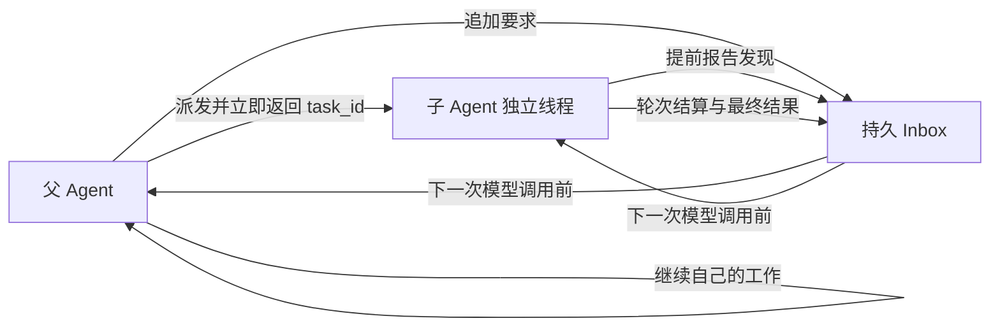

<div align="center">
  

  <h1>SAYACODE 2.0</h1>

  <p><strong>基于 LangChain 与 LangGraph 的本地终端编程 Agent</strong></p>
  <p>原生工具调用、持久会话、动态计划、continuable 子 Agent、人工审批与 Jev 自动审理。</p>

  <p>
    <a href="https://github.com/saya-ch/sayacode/actions/workflows/ci.yml"></a>
    
    
    
    <a href="LICENSE"></a>
  </p>
</div>

SAYACODE 在终端中读取、修改和验证真实项目。Agent 循环、消息状态、Todo、工具调用、人工中断和检查点由 LangChain / LangGraph 管理；项目代码只负责 CLI、系统工具、权限策略、continuable 子 Agent 和 Git worktree 交付。

> 2.0 是破坏性重写，不读取或迁移旧配置与旧会话。SAYACODE 1.4.0 保存在 [`legacy/1.4.0`](https://github.com/saya-ch/sayacode/tree/legacy/1.4.0)。

## 核心能力

| 能力 | 实现 |
|---|---|
| Agent 运行 | LangChain `create_agent` 编译图 |
| 状态与恢复 | LangGraph checkpoint，SQLite 持久化 |
| 动态计划 | 官方 `TodoListMiddleware` 与 `write_todos` |
| 文件与代码 | 分段读取、写入、精确替换、搜索、符号分析 |
| Shell 与 Git | 本机异步 Shell、进程树清理、只读 Git 查询 |
| Multi-Agent | 独立 LangGraph 线程、双向 Inbox、多轮继续、worktree 交付 |
| 权限 | 只读、询问、Jev 自动审理、完全信任 |
| MCP | LangChain 官方 MCP Adapter |
| 上下文管理 | 官方摘要、上下文编辑、文件搜索和工具筛选中间件 |
| 可观测性 | 原生事件流、LangChain callback、本地审计与 JSONL |
| 扩展 | Hook、Markdown 命令、项目记忆、人格与双语界面 |

## 快速开始

要求 Python 3.11 至 3.13。Windows 与 Linux 使用同一份锁文件。

```bash
git clone https://github.com/saya-ch/sayacode.git
cd sayacode
python -m pip install uv==0.12.5
uv sync --locked
uv run sayacode
```

首次启动会打开模型设置向导。也可以稍后输入：

```text
/model add
```

向导要求填写接口协议、`base_url`、API Key、模型 ID、上下文长度和最大输出 token 数。

启动指定工作区：

```bash
uv run sayacode --workspace /path/to/project
```

PowerShell：

```powershell
uv run sayacode --workspace C:\develop\my-project
```

单次执行：

```bash
uv run sayacode -p "检查当前改动并修复失败测试"
uv run sayacode -p "只读分析这个仓库" --trust read_only
uv run sayacode -p "输出项目结构" --output-format json
uv run sayacode -p "执行任务" --output-format jsonl
```

| 退出码 | 含义 |
|---:|---|
| `0` | 成功完成 |
| `1` | 运行失败 |
| `2` | 参数或配置错误 |
| `3` | 需要交互审批 |
| `130` | 用户强制中止 |

## 模型接入

SAYACODE 不预设服务商。每个模型配置明确选择传输协议：

| 协议 | 配置值 |
|---|---|
| OpenAI Chat Completions | `openai_chat_completions` |
| OpenAI Responses API | `openai_responses` |
| Anthropic Messages | `anthropic_messages` |
| Gemini Native generateContent | `gemini_generate_content` |
| Ollama Native Chat | `ollama_native_chat` |

协议决定请求格式和 LangChain 适配器。SAYACODE 不根据公司名、地址或模型名猜测协议。API Key 使用隐藏输入并直接保存在本地配置中；不会从环境变量读取模型凭据。只有无鉴权端点才应输入 `none`。

```text
/models
/model add
/model key <profile>
/model use <profile>
/model test [profile]
/model remove <profile>
```

最小配置：

```json
{
  "default_profile": "main",
  "default_trust": "ask",
  "profiles": {
    "main": {
      "name": "main",
      "protocol": "openai_chat_completions",
      "base_url": "https://api.example.com/v1",
      "api_key": "YOUR_API_KEY",
      "model_id": "YOUR_MODEL_ID",
      "context_length": 128000,
      "max_output_tokens": 8192
    }
  }
}
```

## 权限与 Jev 审理

权限属于当前会话。新会话使用用户默认档位。

| 档位 | 行为 |
|---|---|
| `read_only` | 只提供读取、搜索、分析和只读协作工具；不提供 Shell、写文件和未知 MCP 工具 |
| `ask` | 读取自动执行；每次有副作用的调用请求用户批准 |
| `jev` | 使用与 `ask` 相同的工具范围；Jev 自动批准低风险调用、把不确定调用交给用户、拒绝明确越权调用 |
| `full` | 跳过工具审批 |

```text
/trust read_only
/trust ask
/trust jev
/trust full
/trust default ask
```

配置 Jev：

```text
/reviewer setup
/reviewer test
/reviewer status
```

Jev 使用 TypeSafe 官方异步 SDK。判定绑定真实工具名、调用 ID 和完整参数摘要。参数被截断或敏感字段被脱敏时，调用强制转人工审批。服务不可用、结果异常或置信度不足时同样转人工。

SAYACODE 没有操作系统沙箱。`ask`、`jev` 和 `full` 下的文件工具与 Shell 可以访问工作区之外的绝对路径；Shell 以当前本机用户权限运行。

## 工具式规划

SAYACODE 使用官方 `TodoListMiddleware`，不维护第二份计划状态。主 Agent 会在复杂任务中：

- 用 `write_todos` 建立和更新计划；
- 派发独立子任务后继续可并行的工作；
- 在验证失败、用户要求变化或子 Agent 返回新证据时重新规划；
- 检查交付与验证结果后再完成父任务 Todo。

```text
/todos
```

## Continuable 子 Agent

每个子 Agent 拥有独立的 LangGraph `thread_id`、消息、Todo、审批状态和 checkpoint。派发会立即返回，父 Agent 与子 Agent 可同时推进。


```mermaid
flowchart LR
    P[父 Agent] -->|派发并立即返回 task_id| C[子 Agent 独立线程]
    P -->|继续自己的工作| P
    P -->|追加要求| I[持久 Inbox]
    C -->|提前报告发现| I
    C -->|轮次结算与最终结果| I
    I -->|下一次模型调用前| P
    I -->|下一次模型调用前| C
```

子 Agent 当前轮次结束后进入 `idle`，仍可继续：

```text
/team list
/team status <task-id>
/team followup <task-id> <message>
/team stop <task-id>
/team resume <task-id>
```

| 工具 | 用途 |
|---|---|
| `delegate_to_subagent` | 创建 builder、planner 或 reviewer |
| `send_message_to_subagent` | 父 Agent 向直接子 Agent 发送后续消息 |
| `report_to_parent` | 子 Agent 提前报告关键发现 |
| `task_status` | 查询状态和完整结果 |
| `task_wait` | 在确实受阻时限时等待 |
| `task_delivery` | 查看 builder 交付差异 |

父子消息持久化到 LangGraph Store，并在下一次模型调用前进入接收线程状态。接收方繁忙时等待下一个模型步骤，空闲时自动启动一轮，等待审批时继续排队。

自动注入的单条结算结果默认限制为 16 KiB；完整结果仍可通过 `task_status` 获取。连续后台唤醒默认最多三轮，真实用户输入会重置预算。

```text
/settings set task_notice_limit_bytes 32768
/settings set max_consecutive_wakes 5
```

### Builder 交付

Git 项目中的 builder 使用独立 worktree。派发时的已提交、未提交和未跟踪内容都会进入任务快照。

```text
/team spawn builder 修复解析器并运行测试
/team diff <task-id>
/team apply <task-id>
/team cleanup <task-id>
```

交付不会自动合入主工作区。冲突时不会部分应用。worktree 用于组织交付，不构成安全边界。

## 会话与上下文

```text
/new
/sessions
/session use <thread-id>
/session rename <title>
/history
/compact [focus]
/rewind [index|checkpoint-id]
```

- 消息、Todo、摘要和中断只保存在 LangGraph checkpoint。
- Store 保存会话目录、父子关系、Inbox、任务状态和交付元数据。
- `/rewind` 只改变对话图状态，不撤销文件、Shell 或 Git 操作。
- `/compact` 使用官方摘要中间件处理旧消息。

## MCP、Hook 与项目约定

MCP 使用 LangChain 官方适配器。项目 `.mcp.json` 只有在工作区被显式信任后才会激活。

```text
/mcp status
/mcp trust
/mcp reload
/mcp untrust
```

Hook 支持 `SessionStart`、`UserPromptSubmit`、`PreToolUse`、`PostToolUse`、`ToolFailure` 和 `SessionEnd`。

项目可使用 `SAYACODE.md`、`CLAUDE.md`、`.sayacode/commands/` 和 `.claude/commands/`。Markdown 命令支持 `$ARGUMENTS`、`$1`、`$2` 等参数展开。项目记忆和命令只提供提示上下文，不绕过权限策略。

## 架构

```text
cli ───────────────┐
                   v
             application
        ┌──────────┼───────────┐
        v          v           v
      agent    approvals     tasks
        │          │           │
        └──────┬───┴─────┬─────┘
               v         v
             tools   extensions
```

```text
src/sayacode/
├── agent/          create_agent、模型、运行时、事件流
├── approvals/      静态策略、Jev、HITL 中间件
├── tasks/          continuable 生命周期、Inbox、工具、worktree
├── tools/          文件、Shell、Git、搜索与分析
├── extensions/     MCP、Hook、记忆与 Markdown 命令
├── cli/            交互终端、headless、JSONL 与斜杠命令
└── application.py  资源组装入口
```

详细职责见 [docs/architecture.md](docs/architecture.md)。

## 常用命令

输入 `/help <command>` 查看完整用法。

```text
/status      当前会话、模型、任务与用量
/doctor      本地环境诊断
/tools       当前 Agent 可见工具
/git         只读 Git 查询
/symbols     Tree-sitter 符号查询
/analyze     项目结构与依赖分析
/trace       本地运行审计
/memory      用户和项目记忆
/commands    Markdown 自定义命令
/lang        界面与回答语言
/style       回答人格风格
```

## 开发

```bash
python -m pip install uv==0.12.5
uv sync --locked --extra dev
uv run --no-sync python scripts/check_release.py
uv build
```

发布门禁包括完整 pytest、Ruff、MyPy strict、锁文件一致性、CLI 启动检查、wheel 和源码分发包。CI 覆盖 Windows、Ubuntu 与 Python 3.11、3.12、3.13。

## 版本线

| 版本 | 分支或标签 | 状态 |
|---|---|---|
| 2.0 | `main` | 当前架构 |
| 1.4.0 | [`legacy/1.4.0`](https://github.com/saya-ch/sayacode/tree/legacy/1.4.0) | 历史版本，仅保留 |

## License

[MIT](LICENSE)
