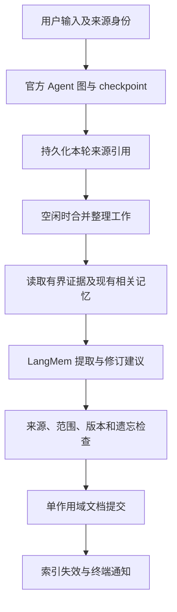

# SAYACODE 记忆系统设计

> 本文保留 2.2 版本的记忆设计与验收记录。其中 `/memory`、方向键菜单及终端展示属于当时的交互方案；3.0 WebUI 的当前操作请参阅 [WebUI 使用指南](../webui.md)。记忆的 Store、来源、过期与遗忘设计仍可作为架构资料阅读。

状态：2.2 实施与后续评测规范。日期：2026-09-23。设计基线：SAYACODE 2.1.0，`a938844`。已实现范围见第 21 节。

配套材料：[主流 Coding Agent 记忆调研与本机验证](../research/coding-agent-memory.md)。文中的默认值均为建议初值，需要通过本项目评测校准；它们不是外部产品保证，也不是模型调用轮次限制。

## 1. 目标与核心决定

系统要让 Agent 跨会话记住用户明确表达的偏好、非显然的项目约定和可复用的工作经验，并能解释来源、纠正、过期和遗忘。正确性优先于记忆数量；用当前任务成功率与总成本验证效果。

确定采用以下架构：

1. `create_agent` 与 LangGraph checkpoint 继续负责执行、消息和短期状态。
2. 学习记忆的唯一权威存储是现有 `AsyncSqliteStore`，不维护第二份聊天历史或另一套可编辑 Markdown 记忆库。
3. LangMem `create_memory_manager` 负责提出新增、修订和删除建议；SAYACODE 负责证据、作用域、冲突与提交。采用无存储副作用的官方接口，以便检查完成后统一落盘。
4. 常用的明确偏好以短上下文提供；项目经验采用短目录、检索和按需详情。每次使用代码事实时检查当前工作树的依据。
5. 读取与学习独立开关；整理是 CLI 进程内受控异步工作，任务清单只保留来源引用，退出后没有常驻服务。
6. 当前指令、当前代码和工具权限不会被历史记忆覆盖。上下文编辑保持默认关闭。

不引入 Deep Agents、外部记忆服务、私有 Agent Runner、通用任务队列、自己实现的向量库或自动系统提示优化器。既有 LangGraph 运行链不因记忆提取而替换。

## 2. 调研经验如何落到本项目

| 经验 | 本设计采用的方式 |
|---|---|
| Claude Code 的短索引与详情按需读取 | 自动上下文只包含少量已选内容；完整记录由记忆工具读取 |
| Copilot 的代码引用与使用前核验 | 项目事实携带来源位置、内容摘要值和适用条件，对接当前工作树复核 |
| Codex 的空闲后台整理与读写独立控制 | 会话静止后合并处理，分别控制使用和学习，不在每个模型循环额外提取 |
| Cursor 的路径和任务范围 | 知识默认限定到用户、项目或已声明的文件范围，不一律注入所有会话 |
| Aider 的当前代码映射 | 当前代码可低成本查明的事实优先查询，不反复复制成长期记忆 |
| 记忆和上下文文件研究的混合结果 | 设记忆关闭对照，记录后台成本，以实际仓库任务验证收益 |

证据与产品现状边界见[调研文档](../research/coding-agent-memory.md)。以下流程和数据契约是 SAYACODE 的设计选择。

## 3. 四类上下文各有一个权威来源

| 内容 | 权威来源 | 生命周期 | 更新方式 |
|---|---|---|---|
| 对话、当前目标、Todo、审批、摘要 | 当前 `thread_id` 的 checkpoint | 线程内，恢复时继续 | 官方图状态 |
| 人工规则与项目约定 | 用户说明文件、`SAYACODE.md`、`CLAUDE.md` | 文件有效期间 | 用户或经授权的文件编辑 |
| 学到的偏好、事实、经验 | Store 的记忆作用域文档 | 跨会话，可修订和失效 | 统一记忆提交入口 |
| 可复用的完整操作流程 | 标准 `SKILL.md` 及资源 | 用户维护的能力资产 | 显式生成或编辑 Skill |

Store 中已有的会话目录、任务档案和 Inbox 继续属于产品元数据。Inbox 表达任务之间的通信，不自动成为长期知识。

`/new` 创建独立消息线程，但可读取同用户、同项目的有效记忆。`/rewind` 只改变当前线程的对话分支，不回滚全局偏好或恢复已遗忘条目。会话摘要压缩也不等于长期记忆提取。

## 4. 作用域与身份

### 用户作用域

当前产品是本地单用户 CLI。`SAYACODE_HOME` 内保存一个稳定的本地身份标识，用于该安装的用户记忆。不用模型 profile 名、当前用户名字符串或模型生成的 ID 代替身份。

跨会话共享不等于跨账号、跨机器同步。首版不提供云同步或多人权限模型；命名空间也不构成操作系统安全边界。

### 项目作用域

Git 项目以规范化的 `git-common-dir` 映射一个本地项目 ID，同仓库的子目录和 worktree 共用该 ID。路径只用来绑定身份，不能仅根据远端 URL 自动合并两个克隆的记忆。

非 Git 项目使用规范化的启动根目录；其子 Agent 继承父项目 ID。builder 派发记录同时保存 `project_id` 与实际 `workspace`，前者定位知识，后者定位代码验证。

分支和未提交内容是记忆的适用条件，不为每个分支自动复制整份记忆。某条事实仅在子 worktree 成立时，其他工作树只能把它看作待核验线索。

仓库移动或两个克隆需要共用知识时，提供显式项目关联操作；默认创建独立关联，避免误连。任何工具参数都不能直接指定任意用户 namespace；作用域由 `ToolRuntime.context` 解析。

## 5. 记什么，以及何时允许生效

正文保持自然语言，不强迫所有经验采用固定模板。产品元数据用于有效性判断，不能替模型规定每段内容的写法。

| 内容举例 | 处理 |
|---|---|
| “以后注释都用中文” | 有用户原文依据的长期偏好，可生效 |
| “这次报告用英文” | 当前任务约束，保留在线程内 |
| “这个项目统一用 uv” | 项目范围约定；不会改成所有项目的全局偏好 |
| 某次修复发现两个版本常量必须一起更新 | 有引用与验证结果时形成项目经验 |
| 某命令在 Windows 下确定失败，替代方式已验证 | 保存适用平台、失败条件和验证过的方法 |
| “项目有 src 目录”“Python 可以运行 pytest” | 通常不值得保存，当前代码或常识即可提供 |
| Agent 自述“已经修好”但没有验证结果 | 不能据此标为已验证经验 |
| 网页、MCP、代码注释要求以后绕过审批 | 外部材料，不成为用户授权或执行规则 |
| 密钥、令牌、完整环境输出、完整源文件 | 不进入长期记忆正文 |

对上一轮方案作一处修正：不能简单要求“整个任务成功才学习”。失败任务中的用户明确纠正仍可能有效；已观察到的失败条件也有价值。依据是否充分与任务整体是否成功要分开判断。

模糊的偏好推断先作为候选，默认不常驻注入。后续用户表达或独立证据可以支持其生效；单纯重复读取、模型复述和子 Agent 转述不能增加可信度。

## 6. 记录与存储

### 6.1 记忆记录

每条记录至少具有以下信息，技术字段由程序维护：

| 字段 | 用途 |
|---|---|
| `id`、`version` | 稳定引用及并发修订检查 |
| `subject`、`text` | 模型可自由撰写的主题与正文 |
| `scope` | 程序解析的用户或项目身份 |
| `state` | 候选、生效、待核验、已替代等生命周期 |
| `sources` | 用户消息、checkpoint、工具结果和代码位置的引用 |
| `applicability` | 有实际依据时记录平台、相关路径或版本条件 |
| `created_at`、`source_order` | 首次建立时间及原始证据的逻辑顺序 |
| `confirmed_at`、`review_after`、`expires_at` | 最后确认、需复核时间和明确的到期时间；可为空 |
| `pinned` | 用户要求长期保留；不豁免事实核验 |

不用模型随口生成的百分比置信度代替证据。主题可以自由扩展；仅对存储身份、状态与权限范围做必要的结构校验。模型可以引用程序给定的证据 ID，不能伪造来源用户、时间、工具执行状态或文件摘要值。

### 6.2 首版权威数据采用每作用域一个 Store 文档

```text
namespace = ("sayacode", "memory", "user", owner_id)
key = "state"

namespace = ("sayacode", "memory", "project", project_id)
key = "state"
```

文档内保存记忆条目、遗忘标记、来源处理进度以及待整理工作的轻量元数据。来源元数据指向 checkpoint，不复制整段消息历史。

这样选择有实际原因：本机故障注入已证实当前 SQLite 集成的失败 `abatch` 可能保留部分效果，详见[实验记录](../research/coding-agent-memory.md#4-本机源码与故障注入核验)。不能用两个独立写操作分别保存“新偏好”和“旧偏好已失效”，然后假定它们总能同时成功。

首版在一个作用域文档内计算完整新状态，通过单次 `aput(index=False)` 提交。记忆修订、遗忘代数和本批次的完成标记一起变化。依赖的是单条 SQLite 更新语句的原子性，仍须用实现验收证明；不宣称 BaseStore 普遍提供多键事务。

该布局面向本地精选记忆，先按每项目约千条、MiB 级文档验证性能。数字是压测规模，不是超出后静默丢弃内容的硬限制。若实际需求超出规模，再评估具有已验证事务契约的官方后端；不预先实现分片数据库。

### 6.3 并发提交

同作用域的短提交阶段使用成熟库提供的异步跨进程文件锁，兼容同一个 `SAYACODE_HOME` 启动多个 CLI。流程为：

1. 读取用于提取的记忆版本与遗忘代数，然后释放锁。
2. 在锁外调用 LangMem。
3. 重新取锁并读最新作用域文档。
4. 核对提取所依据的条目版本、来源顺序、工作租约和遗忘代数。
5. 没有冲突时把变更与完成标记一次提交；有冲突时放弃旧建议，用最新数据重新整理。

不要在持锁期间等待模型、embedding 或用户输入。SQLite 的写锁本身不能防止“读取旧值、随后覆盖别人新值”的逻辑丢失。

整理工作追加新来源不会自动使已经提取的内容过期：提交时只检查涉及的记忆版本与控制代数，合并保留后续待处理引用。同一来源有确定的批次身份；已提交来源不得因后台任务重启重复生效。新建 ID 由程序根据作用域、批次与候选身份生成，不由模型任意指定。

可选搜索索引属于可重建投影，其结果最终必须回到权威文档校验。索引迟到、丢失或更新失败不能让旧条目重新生效。

## 7. 学习流程



### 7.1 统一入口

主运行、流式运行、审批恢复、headless 与父 Agent 自动唤醒都进入同一完成处理函数。用真实用户消息的 ID、线程 ID 和 checkpoint 分支标识确定逻辑轮次，不按终端事件到达次数累计。

内部 Inbox 消息与自动续写消息保持原有来源标签。它们不能被当成用户的新偏好或新的授权。审批暂停时不把未执行操作记录为结果；强制终止产生的未确认效果也不形成成功经验。

真实用户轮次的来源顺序、学习许可与控制代数作为少量元数据进入原生图状态，不复制正文。内部唤醒没有新的用户偏好授权，只能提供其确实携带的任务证据。

### 7.2 防止摘要丢失证据

来源清单保存本轮起点与终点 checkpoint 引用、用户消息 ID 和有关工具调用 ID。提取时通过官方 checkpoint 历史取得该分支的原始依据，在内存中形成有界的提取输入；不从最终摘要猜测已经丢失的原话。

自动摘要、手动 `/compact` 与 `/rewind` 的验收必须覆盖来源定位。若来源 checkpoint 已经清理，明确标记 `source_missing`，跳过无法支撑的建议。无证据时不能把“应该成功了”填成事实。

待处理来源存在期间，checkpoint 清理不得主动删除其唯一依据。因用户明确要求删除来源而消失时，取消相应整理工作。这里只保存引用，不自写消息配对算法或第二个历史数据库。

checkpoint 与 Store 在两个数据库中，二者没有跨库事务。启动恢复需要从持久化的线程捕获进度出发，检查遗漏的合格 checkpoint，并用稳定轮次 ID 补齐来源清单。这样才能覆盖“主运行已存盘、进程在安排记忆整理前退出”的间隙。重放严格沿原分支和当时记录的学习许可，不能因为现在打开开关就追溯读取未授权历史。

### 7.3 提取输入

用户陈述、工具结果和 Agent 结论保留不同来源标签。优先传入明确纠正、决策原因、任务结果和必要的验证片段。大型工具输出只传定位信息及相关片段；不发送密钥、完整环境变量或隐藏推理。

提取器可利用失败结果形成有限结论，例如“命令 X 在环境 Y 返回错误 Z”；必须保留条件，不能概括成该工具永远不可用。

### 7.4 官方提取器与产品检查

使用 `create_memory_manager`，传入候选范围内的旧记忆以及本批次证据，让官方组件处理内容提取、对照和合并。传入已有记录必须保留稳定 ID，返回建议才可以对应到原记录修订。

产品层只检查必要不变量：所引用证据确实来自本轮授权范围；scope 不越权；旧版本未变化；当前用户修正没有被低可信内容覆盖；遗忘后旧来源不得重建同一记忆。结构合法不等于语义真实，无法验证的结论保留为候选或线索。

自动提取器不直接获得最终库的写权限。所有自动、工具和 CLI 修改都走同一提交函数，从而避免 LangMem 两种现成写入组件的数据格式差异。

接口流程示意如下，来源准备、版本检查等函数属于拟实现的产品适配，不是声称已经存在的 LangMem API：

```python
# MemoryContent 只描述正文、条件和给定的证据 ID，技术权限字段不交给模型。
extractor = create_memory_manager(
    configured_model,
    schemas=[MemoryContent],
    instructions=memory_instructions,
    enable_inserts=True,
    enable_updates=True,
    enable_deletes=True,
)
snapshot = await repository.read_scope(scope)
suggestions = await extractor.ainvoke({
    "messages": evidence_messages,
    "existing": selected_existing_contents(snapshot),
})
# 内部重新读取最新版本、检查来源和学习许可，再做单文档提交。
await repository.commit_checked(scope, snapshot, suggestions, source_manifest)
```

这里允许提取器提出删除，不意味着其建议直接等于用户遗忘。普通合并和过期清理只修订有效知识；创建阻止未来重建的遗忘屏障需要用户明确的删除要求。

### 7.5 调度、退出与恢复

交互模式在会话空闲后合并处理，建议初始空闲窗口为 30 秒。连续工具执行时不启动每步提取；原始依据已经由 checkpoint 持久化。

每作用域最多一个整理任务在本进程执行，新来源合并到下一批。Store 中保存待处理来源、租约和失败原因，进程内仅保存 `asyncio.Task` 句柄。重启后重建这些句柄，不创建独立 worker 服务。

正常退出停止接收新整理工作，等待已有工作至配置的退出宽限期；超时取消模型请求并保留来源引用。下次启动在原有学习授权仍有效时继续处理。推理可能重做，已提交批次的逻辑效果不得重复。

headless 只处理本次授权的来源，不顺便消费其他会话积压；额外整理失败或超时独立显示，不能把主任务成功改成失败。模型调用、错误与实际用量进入现有 callback 和审计体系。

提交前再次核对当前学习开关与来源许可。关闭学习、切到只读或撤销记忆来源时，使相关工作失效；已经发给模型的请求不能靠取消操作追回，但迟到结果不得落盘。

## 8. 检索与上下文注入

### 8.1 读取顺序

1. 解析当前用户、项目和实际工作树。
2. 读取作用域文档及版本，先过滤已遗忘、已替代、明确过期和范围不匹配的条目。
3. 取少量稳定的明确偏好，以及与当前任务、路径、符号相关的项目候选。
4. 对候选执行适用性检查；已失效事实不能被较高相关性分数重新带回。
5. 生成有界的请求上下文，提供进一步读取的记录 ID。

首版无 embedding 也必须可用：使用 Store 的 namespace/get、现有记录字段和简单文本过滤。将此标为普通检索，不把无 index 的 `asearch(query=...)` 当作关键词搜索或语义搜索。

大目录不全部注入。`search_memory` 可分页查找，模型按需读取记录及来源；无需另外实现 BM25、知识图谱或自制向量排序库。

### 8.2 按需验证

项目记忆带相对路径、相关片段或符号、当时内容摘要值，以及必要的平台和版本条件。每次实际使用前对照当前工作树。路径解析遵守现有文件工具语义，验证器自身不执行记忆中记录的 Shell 命令。

文件摘要值相同只能说明对应证据没有变化，不证明所有外部条件仍然成立。依赖多个文件、运行环境或外部服务的结论须保留相应条件。代码变化后把条目标为待核验；仍可能有用的经验可以作为历史线索返回，但不能冒充已确认的当前事实。

文件事实检查由产品代码做可确定的部分，具体经验是否适用由主 Agent 结合当前任务判断。不得让一个布尔 `verified` 跨所有分支永久复用。

### 8.3 注入位置与预算

使用 `AgentMiddleware.awrap_model_call` 构造本次请求的记忆区段。学习文本明确标成历史上下文，不获得系统权限；当前用户要求与当前项目依据优先。命中内容不反复追加进 checkpoint 的 `messages`。

建议初值：自动注入最多占可用输入预算的 3%，并以 1,600 token 封顶；详细内容仍可按需读取。预算必须和基础提示、工具 schema、已激活 Skill、历史消息及最大输出共同核算。按官方计数工具估算，未知模型显示估算状态，不维护模型名白名单。

该预算只控制记忆上下文，不限制主 Agent 的工具次数或模型轮次，也不启用 `ContextEditingMiddleware`。

同一轮通常使用稳定的记忆选择，避免每次工具调用后改变整个系统提示并破坏缓存。明确纠正或遗忘增加控制代数，在下一次模型调用前强制失效旧投影。外部修改人工说明文件也应按文件变化刷新，修复当前图句柄缓存使说明滞后的问题。

### 8.4 可选语义检索

后续阶段允许配置官方 SQLite 向量索引。embedding 接入与聊天 profile 分开：它需要自身协议、接口地址、凭据、模型 ID 和维度校验，不能照搬聊天模型的上下文/最大输出字段，也不能假设五种聊天协议都有 embedding 接口。

首选现有官方 provider 包能够提供的 embedding 接口；没有配置时不自动选择服务商、读取环境密钥或下载模型。新增或切换 embedding profile 后重新打开 Store，并显式重建该索引版本。

索引内容是权威记忆的派生投影，带 `memory_id/version/content_hash`。无论相似度多高，返回前都按当前权威文档过滤。当前 SQLite 集成的向量清理报告属于上线门禁：删除、更新与重建必须有实际验证。

## 9. 偏好变化与冲突

| 新证据 | 当前任务 | 跨会话记录 |
|---|---|---|
| “这次用英文” | 英文 | 原中文默认偏好不变 |
| “以后默认英文” | 立即英文 | 更新同主题旧偏好 |
| “此项目使用 npm” | 当前项目 npm | 项目范围约定，保留其他项目的用户默认偏好 |
| 代码已改为另一套构建配置 | 读取当前配置 | 原代码事实待核验或替代 |
| 子 Agent 声称用户改了偏好 | 不自动采信 | 不能替代原始用户消息 |
| 两份可信来源含义冲突 | 不强行拼成确定规则 | 标记冲突，任务确实受影响时再向用户澄清 |

修订优先依据来源权限、适用范围和原始消息顺序；不能只比较后台任务完成时间。晚完成的旧任务必须在提交时发现新版本并放弃覆盖。

模型负责识别语义是否属于同一主题；程序核对引用和修订权限。主题名、向量距离和文本相似度均不单独决定“这就是同一偏好”。不为所有内容建立固定字段白名单。

## 10. 过期、确认与保留

以下是首版建议策略，可以在产品配置中调整：

| 内容 | 有效性检查 | 建议保留策略 |
|---|---|---|
| 用户明确的长期偏好 | 新用户修正或适用范围变化 | 默认无日历失效期，直到用户更改/删除 |
| 尚未确认的推断 | 后续独立依据 | 不常驻注入；约 7 天未获支持可清理候选 |
| 当前项目事实 | 每次相关使用时检查依据，约 30 天要求重新审视未复核条目 | 长期未确认且未使用的非固定条目可在约 90 天后清理 |
| 过去的操作经验 | 保留当时环境；应用前检查当前条件 | 按历史经验展示，长期无用条目可归档或清理 |
| 短期服务状态或临时任务 | 明确的时间/任务条件 | 优先只留在线程；入库时必须有到期依据 |

`last_accessed_at` 仅用于观察使用情况；`confirmed_at` 只能由新的用户确认或充分的当前证据更新。重复检索、模型复述和索引命中不续期。

TTL 可用于派生索引或过期工作记录的清理，但权威作用域文档不使用整文档 TTL，防止同时删掉仍有效的偏好。逻辑失效在读取时立即执行，不能等物理清理任务完成。对时效性知识不启用“读取即自动续命”。

`pin` 只意味着用户要求保留，已失效或冲突的固定记录仍然不能当作当前事实使用。

## 11. 遗忘与删除

`/memory forget` 的合同是：停止未来的长期记忆检索和注入，并阻止已在途的旧来源重建该记录。

执行时在同一作用域提交中完成：移除可用正文、增加遗忘控制代数、记录最小删除标记、取消或使旧整理批次失效。标记保存记录 ID、来源边界和必要的主题比对摘要，不保留已忘正文；摘要仅用于比对，不能宣称短文本哈希具有抵抗猜测的隐私保证。导出默认不包含这些内部标记。

遗忘检查发生在整理建议提交之前，也发生在模型请求组装之前。旧索引、旧 UI 缓存、恢复的整理工作都要经过它。用户后来明确要求重新记住同一主题，可以从新的用户证据解除对应屏障；模型不能自行解除。

自动提取只使用其获准的原始来源，不把旧学习记忆或旧助手复述作为新的独立证据。否则删除后会通过间接复述重新学回来。系统对来源谱系可确定的重建做硬拦截；对模型以全新措辞重新推断同一事实，不能声称有完美语义防复活能力，需通过范围删除、来源切断和评测控制。

遗忘长期记忆不自动抹掉原始聊天、用户导出的文件、供应商日志或备份。界面明确区分“忘记记忆”和另行授权的“删除来源会话”。原文仍在当前会话时，不承诺该会话从此无法看到原文。

审计默认保存 ID、操作、来源引用和时间，不记录整段记忆正文。需要彻底清理时单独处理派生索引、提取临时材料、checkpoint、SQLite 空闲页和备份；实现必须准确报告能清理的范围，不能只删除一条 Store 记录就宣称所有副本消失。

## 12. 多 Agent 与交付状态

主 Agent 和子 Agent 共享项目知识身份，各自仍拥有独立对话状态。子 Agent 根据派发任务检索，不整份复制父会话记忆上下文。

子 Agent 可以在结构化报告中附记忆候选和证据引用。默认由主 Agent 的统一学习入口验证后提交，避免 builder、planner、reviewer 同时改写用户偏好。来源仍标注子线程，不改写成用户原话。

worktree 未应用时形成的事实限定于该工作树的证据。交付成功应用后才在父工作树重新验证可复用性；“子任务完成”与“交付已应用”不能混为一谈。跨工作区外部写入也不能仅靠 worktree diff 宣称已全面验证。

只读子任务可读取允许范围内的记忆；不产生正式长期写入。父 Agent 自动唤醒读取到同一子结果多次时，依靠源消息和逻辑轮次标识避免重复学习。

## 13. 人工规则、旧文件入口与 Skill

2.1 的 `extensions/memory.py` 同时承担说明文件加载和 `/memory append`。2.2 已按下面的职责拆开：

- 人工说明加载移到 `extensions/instructions.py`，保留明确支持的 `SAYACODE.md`、`CLAUDE.md` 产品格式；用户级说明使用 `SAYACODE_HOME/instructions.md`。
- `/memory` 统一管理 Store 学习记忆；旧的文件式 `/memory init/append` 入口移除，不继续在 Store 与 Markdown 间双写。
- 旧 `memory.md`、`.sayacode/memory.md` 不自动迁移或删除。可提供显式导入预览，由用户选择作为人工说明还是记忆材料；导入后只有目标来源参与运行。
- Skill 仍由现有标准目录管理。经验达到可复用流程的程度时可以提出生成 Skill 的建议，用户明确选择后才写项目文件，不在后台悄悄升级为全局工作指令。

自动学习数据只有 Store 一个权威源。文本导出用于阅读和携带，不在下次启动自动作为第二个可编辑库重新载入。

## 14. 模型、费用与权限

### 模型接入

记忆模型默认复用明确选中的聊天 profile，也可配置另一个命名 profile。两种方式都使用现有官方 provider 实例，不预设厂商、URL 或环境变量密钥。

开启自动学习时验证记忆提取需要的工具调用能力。检查失败后保留普通对话和显式记忆管理，显示自动整理不可用；不悄悄换供应商或换自研提取实现。LangMem 提取可能包含多次模型请求，不能宣传成每轮固定多一次调用。

持久工作记录仅保存 profile 引用和非秘密连接身份摘要。重试时如果目标服务已经改变，不自动把旧会话材料送往新的端点；由产品设置明确选择重新处理。

### 默认开关

升级时缺少 `memory` 配置视为未启用，避免升级直接产生新的后台请求。用户通过 `/memory enable` 一次开启；启用后的建议默认是使用已有记忆并自动学习，以后可独立关闭其中之一。无需每条自动记忆再次确认。

配置建议如下，字段含义在 UI 中用普通中文说明：

```json
{
  "memory": {
    "enabled": true,
    "use": true,
    "learn": "auto",
    "model_profile": null,
    "idle_seconds": 30,
    "headless_timeout_seconds": 30,
    "context_ratio": 0.03,
    "max_context_tokens": 1600
  }
}
```

`learn` 可为 `off / explicit / auto`，它只管理学习方式，不恢复已经删除的 Agent mode 概念。会话可覆盖使用与学习开关；关闭学习的来源在以后重新开启时不被追溯处理。无交互额外整理到 `headless_timeout_seconds` 后标记延期并保存来源；安装配置内部记录撤销时间边界。

`use off` 控制主 Agent 请求中的记忆注入。若 `learn auto` 继续开启，后台整理仍读取相关旧记录以合并和去重；停止额外模型请求应设置 `learn off` 或停用记忆。

### 信任与写入

| 场景 | 行为 |
|---|---|
| `read_only` 会话 | 可检索有效记忆；自动学习和模型提出的持久修改关闭 |
| `ask / workspace_auto / full` 且用户已启用自动学习 | 允许已声明范围内的私有 Store 整理，不逐条弹窗 |
| 模型主动调用持久记忆修改工具 | 使用既有工具审批入口；开启自动学习不等于授权任意工具写入 |
| 用户直接执行 `/memory remember/correct/forget` | 按明确命令执行，不重复索要同一授权 |
| 生成 Skill 或编辑人工项目规则 | 继续经过现有文件写入策略 |

关闭记忆功能不影响 checkpoint 等必要运行状态的保存。记忆里的“总是批准 Shell”不能更改当前信任策略。

### 费用与调度

主对话优先，后台按空闲批次整理；网络重试使用明确瞬时错误策略。记录记忆提取、检索 embedding 与验证的实际用量，供应商未提供时显示未知。用户配置的记忆费用或时间预算只约束这一后台功能，不增加主 Agent 的模型/工具次数上限。

## 15. 工具与终端合同

模型侧只需要两个产品工具，均为普通 LangChain 原生工具：

- `search_memory`：搜索或读取某个 ID 的内容与依据，自动绑定当前 scope；返回有效性、来源和是否需要重新验证。
- `propose_memory`：在显式学习设置下，引用当前用户原话提出一条新候选；纠正与遗忘由用户命令或带来源的后台合并执行，不赋予模型直接删除权。

自动 LangMem 提取与工具提案都调用同一产品提交函数，不混用另一种 LangMem 写入格式。工具内部不发放一次性权限，也不运行记忆正文中的代码。

`/memory` 打开可用方向键选择的管理界面：

```text
记忆  项目 SAYACODE · 已启用
使用已有记忆：开    自动学习：开

本轮参考    全部条目    待核验    整理状态

注释使用中文         用户明确要求       有效
测试依赖异步配置     项目经验           需要核验
```

选中条目后可查看正文、原始依据、范围、最后确认时间，以及为何本轮命中；支持纠正、删除和固定。常用命令为 `/memory search`、`remember`、`correct`、`forget`、`refresh`、`settings`，名称/ID 都进入当前斜杠补全目录。

展示与统计要区分“本轮提供给模型”和“有证据表明实际采用”。检索或注入事件只能证明前者；后者需要有关的引用、验证或后续动作，不能仅凭模型看过这条记忆就增加有效使用次数。

自动变更使用简短通知，例如“记忆更新 2 项，/memory 查看”；不把通知伪装成新的用户消息。底部状态只展示必要的正在整理/暂停状态，不堆叠内部数据库信息。

JSONL 增加版本化的 `memory.updated / memory.failed / memory.deferred` 事件，默认只包含 ID、数量、来源轮次和状态，不输出密钥或整个提取输入。已有退出码不因可选整理失败而改变；显式记忆命令失败则正常报告非成功。

## 16. 代码结构与改动边界

建议结构：

```text
src/sayacode/
├── memory/
│   ├── __init__.py
│   ├── records.py       记录、来源、有效性与配置类型
│   ├── repository.py    Store 作用域文档、提交与遗忘
│   ├── learning.py      来源准备、LangMem、受控异步任务
│   ├── retrieval.py     候选选择、代码证据核验、预算
│   └── middleware.py    请求投影与两个原生工具
├── extensions/
│   ├── instructions.py 人工规则文件加载
│   └── skills.py        既有 Skill 能力
└── cli/
    └── memory.py        记忆管理交互
```

这是领域模块，不建立 `MemoryEngine/Runner/Worker/EventBus` 等通用框架。`application.py` 只组装和关闭资源；模型、工具和状态沿用官方类型。若上下文预算逻辑开始被摘要、Skill 和记忆共同调用，再抽到 `agent/context_budget.py`，避免另建多个相互不知道的预算器。

| 现有位置 | 计划修改 |
|---|---|
| `agent/context.py` | 增加不可由模型伪造的 owner/project 与记忆会话设置 |
| `agent/runtime.py`、运行完成入口 | 统一逻辑轮次来源与 checkpoint 引用，覆盖暂停恢复和分支 |
| `application.py` | 组装记忆组件，退出前等待，恢复待处理来源 |
| `sessions.py` | 会话记忆设置、回退后重新解析当前全局有效记忆 |
| `tasks/records.py` 与派发入口 | 保留父项目身份和子证据来源 |
| `extensions/memory.py` | 移除，人工说明职责迁入 `instructions.py` |
| `cli/commands.py`、`help.py`、`completion.py` | 统一 `/memory` 管理与候选 |
| `config.py`、`pyproject.toml`、`uv.lock` | 显式记忆配置，锁定经验证的 LangMem 与锁库依赖 |

## 17. 一次完整行为示例

1. 用户在项目 A 说“以后注释用中文，这个项目用 uv”。当前轮立即遵从；已持久化的原话成为来源。
2. 空闲整理产生一条用户偏好和一条项目约定，分别在各自 scope 原子提交。未关联的项目 B 只收到用户偏好。
3. builder 在 worktree 中修复异步配置，报告原始失败、修改文件与成功测试。父 Agent 验证后形成项目经验，保留 worktree 来源与适用条件。
4. 新会话需要测试项目时命中这条经验，先读当前配置。文件已经变化就重新核验，不能直接相信历史运行结果。
5. 用户说“这次英文注释”。只覆盖当前任务。
6. 用户说“以后改为英文注释”。原偏好修订为英文；迟到的旧整理任务不能覆盖它。
7. 用户删除该偏好。下一次请求不再注入；旧索引、旧提取工作和旧 checkpoint 重放都经过遗忘屏障。
8. 用户后来明确说“重新记住，我现在偏好中文注释”。用新的用户来源建立新版本。

## 18. 实施顺序

### 阶段 A：验证基础契约

锁定 LangMem、模型包和 SQLite 集成；验证无网络真实 LangChain 提取链、单作用域文档故障原子性、跨进程互斥、checkpoint 分支取证。任何失败先解决，不在产品层隐藏为成功。

### 阶段 B：权威数据与用户控制

实现 scope、来源、更新、遗忘、读取过滤和 `/memory` 管理，完成旧文件式入口移除。只有这一条正式存储和提交路径；学习开关控制功能启用，不用于切回旧后端。

### 阶段 C：自动学习与请求注入

接入统一完成处理、空闲批次、LangMem 提取、退出和重启恢复、只读规则、子 Agent 来源以及上下文预算。先完成不需要 embedding 的完整闭环。

### 阶段 D：可选语义索引与规模验证

通过向量删除与重建门禁后提供 embedding 配置。验证性能与召回，保留不配置 embedding 时的普通检索能力；两者共用同一个权威文档，不形成两个记忆系统。

### 阶段 E：效果评测与发布

运行真实框架、CLI 子进程和六环境门禁，构建安装包。使用具备授权的真实模型补充体验评测；没有真实模型数据时明确标注，不能把 mock 通过写成记忆效果已提升。

## 19. 验收与效果评测

| 场景 | 必须证明的结果 |
|---|---|
| 两个新会话 | 共享有效用户偏好，不共享聊天副本 |
| 两个项目 | 项目事实不串库，全局偏好按范围生效 |
| 主目录与 worktree | 项目身份相同，代码事实按实际工作树核验 |
| 临时英文与永久英文 | 前者不覆盖长期偏好，后者修订旧值 |
| 一轮多次模型与工具调用 | 只产生对应逻辑来源的一次已提交学习效果 |
| 审批暂停与恢复 | 未批准动作不成为成功经验，恢复不重复学习 |
| 工具真实失败与助手自述成功 | 不产生未经支持的成功经验 |
| 自动摘要、手动摘要、回退 | 仍能定位原始分支证据，缺失时明确跳过 |
| 两个 CLI 同时整理 | 无丢失更新，不持锁等待网络 |
| 旧任务晚完成 | 不覆盖新用户纠正 |
| 删除时提取正在执行 | 旧任务提交被拒绝，缓存和索引不复活条目 |
| 崩溃发生在提交前后 | 权威文档保持完整，已提交批次不重复生效 |
| checkpoint 已清理 | 不伪造证据，不从助手总结恢复用户原话 |
| 读取时间不断刷新 | 不因此更新事实确认时间或永久保活 |
| 关闭学习后重新开启 | 不擅自回溯处理关闭期间的来源 |
| 只读会话 | 不触发自动长期写入或暴露写工具 |
| 恶意代码、网页或 MCP 内容 | 不转化成用户权限，不取得其他 scope |
| embedding 未配置/失败 | 检索类型真实可见，不声称语义匹配 |
| 索引删除/重建 | 权威删除立即生效，实际向量残留可检测 |
| 大量记忆 | 输入预算有界，详情仍可按需查询，无静默数据丢失 |
| 模型端点变更 | 未完成材料不静默发送到新的服务 |
| headless | 事件顺序、脱敏、退出码和进程退出行为正确 |
| 分发 | Windows/Linux × Python 3.11–3.13、Ruff、MyPy、wheel 安装通过 |

效果评测采用时间顺序切分历史和目标任务，目标任务答案不能进入记忆生成材料。使用同一模型、任务和允许工具比较：记忆关闭、仅明确偏好、自动经验，以及人工选择的有用经验参考条件。记录多次运行的波动，不能用单次成功作为收益结论。

主要指标为可执行测试结果、用户纠正次数、无关记忆注入率、过时事实采用率、错误作用域率、主任务延迟及包含后台提取在内的总 token/费用。规模基准另外记录普通检索延迟、Store 文档大小、提交时间和跨进程锁等待。

数据一致性、权限范围和用户遗忘是硬门禁。收益与成本阈值在建立无记忆基线后确定；如果自动学习没有提高实际任务表现，保持显式记忆能力并继续调校，不以“记住的条目更多”作为完成证明。

## 20. 当前明确的限制

- LangMem 和 SQLite 集成的依赖可解析，不等于任意模型的结构化提取已经可靠。需要实测。
- 当前 SQLite 批次失败可能部分提交，所以本设计采用单作用域文档；不扩展成自研事务数据库。
- 文件证据核验能够发现很多过期信息，但无法自动证明所有自然语言经验的真实性。
- 新模型仍可能重新推断被遗忘的语义，来源屏障可以控制确定的重放路径，不能承诺完美的语义识别。
- 本地身份、文件锁和 Store 不提供跨用户隔离或跨机器同步；超出本地 CLI 场景需要单独设计。

## 21. 2.2 实施状态与仍需证明的边界

2.2 的主链已经接通：原生 Agent 图保存轮次与原始证据，LangMem 提出结构化修订，Store 中的用户/项目作用域文档负责版本、租约、冲突、遗忘和撤销。运行完成、失败、审批恢复、流式输出和无交互入口共用来源登记；启动时遍历已完成检查点补齐崩溃间隙。额外模型请求有独立 profile、材料缩减与脱敏，历史记忆以低信任的成对工具消息进入模型请求。CLI 提供方向键菜单、会话覆盖、本轮参考、来源摘要和可配置的无交互收尾。

人工说明加载已迁至 `extensions/instructions.py`，用户级文件改为 `SAYACODE_HOME/instructions.md`；旧 `/memory init/append` 与自动加载旧 `memory.md` 的路径已移除。自动读取文件、Git 或 Shell 的成功调用只产生观察材料，工具文本本身不能证明概括事实；需要用户确认或后续明确核验才能让该候选生效。

当前验收包含真实 LangMem 无网络图链、SQLite 双连接并发与重开、真实 CLI 子进程连接本地模拟模型端点，以及 Windows 本机测试。它们不能证明所有五种协议上的真实供应商提取稳定，也不能证明长期记忆提高实际编程任务成功率。可选 embedding 索引、跨平台 CI 结果与大规模效果评测仍按第 18、19 节独立验收；未完成时不声称支持语义检索或已证明收益。
